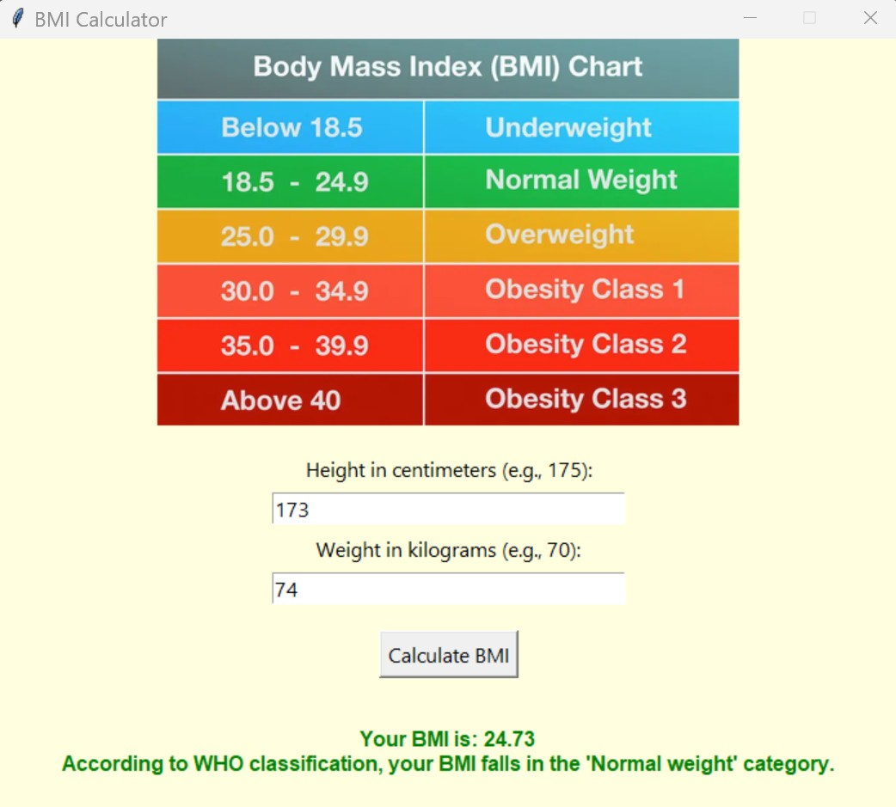

# BMI Calculator GUI Application

This project is a Body Mass Index (BMI) calculator built as a Graphical User Interface (GUI) application using Python and the **Tkinter** library.

The application allows users to input their height and weight to calculate their BMI and determine the corresponding WHO category.

## Features
- User-friendly interface for seamless data entry.
- Real-time BMI calculation with results displayed in a color-coded format.
- Robust error handling for invalid or non-numeric input.
- Integration of a visual BMI chart to enhance the user experience.

## Requirements
To run this application, you need to have Python installed on your system.
You also need the `Pillow` library to handle the image. You can install it using pip:
`pip install Pillow`

## How to Run
1.  Ensure you have the required libraries installed.
2.  Clone or download this repository.
3.  Run the script from your terminal:
    `python BMI_calculator.py`
